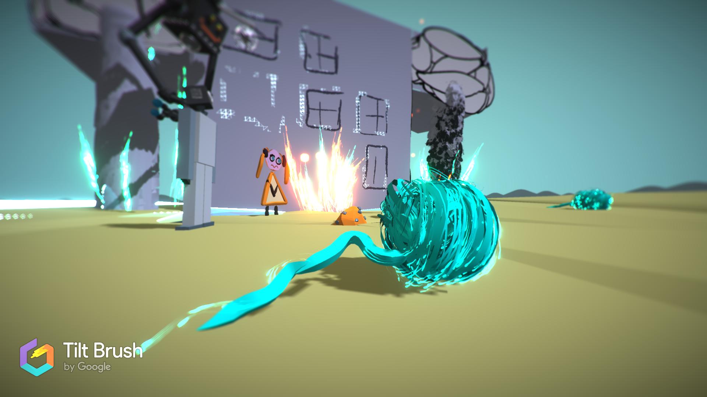

# UC001-Text101

Second practice in the Udemy course [Complete C# Unity Developer 2D - Learn to Code Making Games](https://www.udemy.com/unitycourse/)

Development platform: Windows 10; Unity 2018.2.6f1

##Text-Advanture Game

+ **What is the game theme?**
SiFi Scenario with robots. 

+ **Image that sums up the game theme**

+ **Who is the player?**
the player slips into the role of Eduard the service robot. 

+ **What is the goal?**
Keep your godhuman alive (does not die of thirst) until rescue is approaching.   

Storyplot: An unfortunate accident destroyed all water inventories in Xland and dameged some assitance robots in a way they think to be fighting robots. 
This is a very dramatic situation because Xland suffers from a long dry preiod and no other water accurences are available. 
Eduard a service robot has to ensure that Magdalena, his godhuman, does not die of thirst until rescue is approaching. 
In this area a special kind of wool is produced which extracts water or argon from air dependent on the knitted pattern.
Eduard now has the goal to find the wool before the fighting robots, who also aim to collect the wool to produce laser weapons on the basis of acron. 

Sources: 
Fonts: google fonts. 
